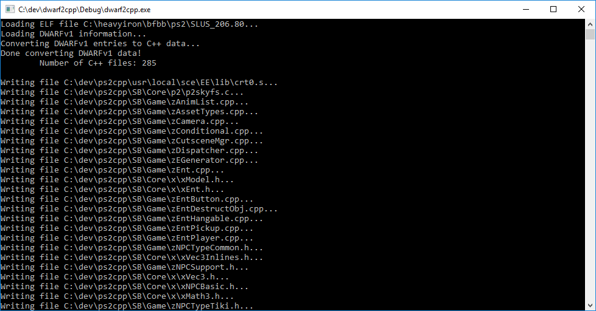
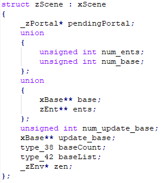
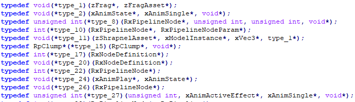
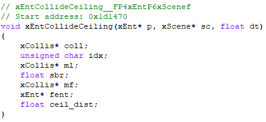

# dwarf2cpp
This tool reads DWARF 1.0/1.1 data from an ELF file and converts it into C/C++ files containing all struct, enum, union, and function definitions, as well as variable declarations, that it finds in the DWARF data.



Below is an example of a struct that can be reconstructed from a DWARF entry. This tool supports inheritance, pointers/references to user types, and unnamed unions, among other things.



If you see a variable or struct member that has the type "type_" followed by a number, that type is either a function pointer type or an array. At the top of the file, along with typedefs for all named structs, enums, unions, you'll also find typedefs for function pointer types and arrays.




Below is an example of a function definition. This tool reads argument names and types, as well as any local variables declared within the function. It also prints the mangled version of the function name and the address of the first instruction in the function. **Note that the function's signature might be missing some arguments.** DWARF data sometimes doesn't include unused arguments in function entries. You can use the mangled name to figure out which arguments are missing from the signature.



This tool was built specifically as a reverse engineering tool for the PS2 version of SpongeBob SquarePants: Battle for Bikini Bottom, but it may work with other games and programs as well, provided that they contain DWARF 1.0/1.1 debugging information (DWARF 2.0 and up is *not* supported) and the DWARF structure is the same as what is expected from this tool.

Please note that this tool is not meant to generate *compilable* code. The code that's generated may be syntactically correct, but it is only meant to be a starting or reference point for reverse engineering a piece of software. The C++ generation code is overall fairly simple and only generates definitions in the order that they are read in from the DWARF data. Struct definitions, for example, will likely run into "incomplete type" errors if they contain values of types that haven't been defined yet. This tool will not decompile functions for you either, so function definitions will only contain local variable declarations and no other statements.

## Compiling
This tool makes use of the std::experimental::filesystem library (C++17). A Visual Studio solution is included.

If using gcc you can compile with:
```
g++ *.cpp -o dwarf2cpp -lstdc++fs
```

[More information](https://www.codingame.com/playgrounds/5659/c17-filesystem) (See Compiler/Library support)

## Usage
```
dwarf2cpp <input ELF file> <output directory>
```

* `<input ELF file>` is the path to your ELF file. It can have any extension.
* `<output directory>` is the path to a directory that you want the C/C++ files to be written to. This tool takes the path of every compile unit and replaces the root of the path with the directory path you specify here.
  * Example:
  * `<output directory>` is `C:\Users\your-username\Desktop\Code\`
  * A compile unit's path is `C:\SB\Core\x\xEnt.cpp`
  * The output file will be `C:\Users\your-username\Desktop\Code\SB\Core\x\xEnt.cpp`

## Customization
You can edit [cpp.h](cpp.h) and [cpp.cpp](cpp.cpp) to customize how the C/C++ output is generated. Currently, there are no customization options that can be passed as command line arguments to this tool.
